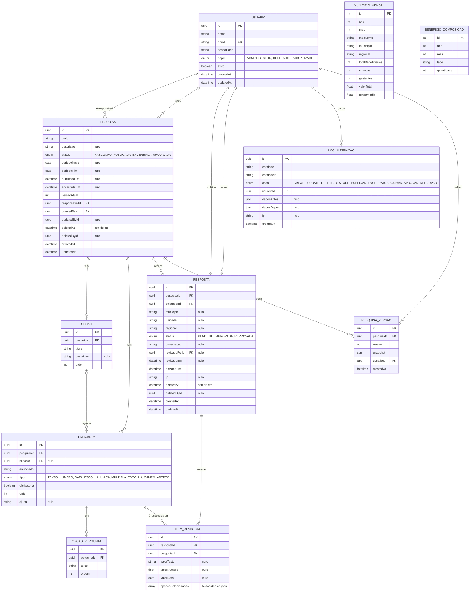

# CriaPesquisa — Modelo ER (banco de dados)

Diagrama entidade-relacionamento do banco (PostgreSQL via Prisma). Renderiza no
preview de Markdown do VS Code (com extensão Mermaid) e no GitHub.

## Como ler as relações

| Relação | Cardinalidade | Significado |
|---|---|---|
| Usuário → Pesquisa (responsável) | 1 : N | cada pesquisa tem **um** responsável (`responsavelId`) |
| Usuário → Pesquisa (criou) | 1 : N | quem cadastrou (`createdById`) |
| Usuário → Resposta (coletou) | 1 : N | quem enviou a resposta (`coletadorId`) |
| Usuário → Resposta (revisou) | 0..1 : N | quem aprovou/reprovou (`revisadoPorId`, opcional) |
| Pesquisa → Seção / Pergunta / Resposta / Versão | 1 : N | uma pesquisa tem várias |
| Seção → Pergunta | 0..1 : N | a pergunta **pode** estar numa seção (`secaoId` opcional) |
| Pergunta → Opção | 1 : N | opções das perguntas de escolha |
| Resposta → Item / Pergunta → Item | 1 : N | cada resposta tem um item por pergunta respondida |

## Notas importantes

- **Soft-delete**: `PESQUISA` e `RESPOSTA` usam `deletedAt` + `deletedById` — os registros não são apagados de fato (proteção contra perda de dados / funcionário desligado).
- **Auditoria**: `LOG_ALTERACAO` guarda toda ação (create/update/delete, publicar, aprovar, reprovar…) com `dadosAntes`/`dadosDepois` em JSON. `entidade`/`entidadeId` referenciam qualquer registro (relação polimórfica, sem FK).
- **Versionamento**: `PESQUISA_VERSAO` guarda um `snapshot` (JSON) da pesquisa por versão; único por (`pesquisaId`, `versao`).
- **`ITEM_RESPOSTA.opcoesSelecionadas`** guarda os **textos** das opções escolhidas (array), e **não** uma FK para `OPCAO_PERGUNTA` — decisão de simplicidade (a resposta preserva o texto mesmo se a opção mudar depois).
- **`MUNICIPIO_MENSAL`** e **`BENEFICIO_COMPOSICAO`** são tabelas **independentes** (sem FK) que alimentam o **Dashboard** (`GET /api/painel`): totais de beneficiários, mapa, top municípios, evolução do investimento e composição do benefício.
- **Índices/únicos** relevantes: `USUARIO.email` (único); `PESQUISA_VERSAO (pesquisaId, versao)` (único); `MUNICIPIO_MENSAL (ano, mes, municipio)` (único).
